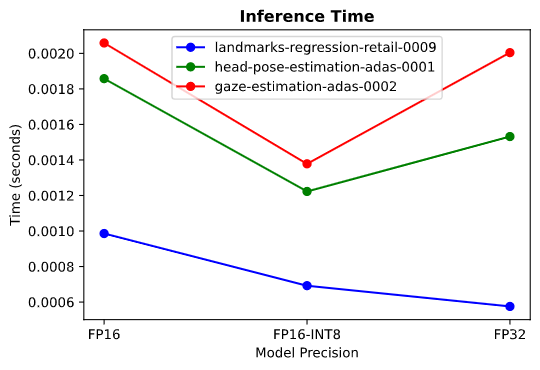
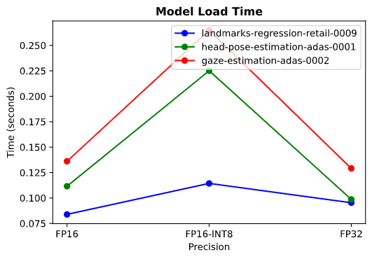
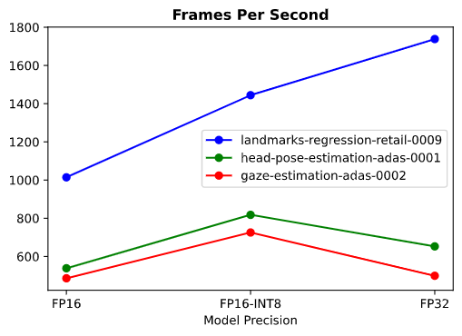

# Computer Pointer Controller

This is a computer vision application that moves the mouse pointer based on eye movements. Four Intel pretrained models were employed in the detection pipeline:
- face-detection-adas-binary-0001 - for detection of human face
- to head-pose-estimation-adas-0001 - for detection of head poses
- landmarks-regression-retail-0009 - for detection of facial landmarks (eyes, nose, etc)
- gaze-estimation-adas-0002 - for detection of eye gazes

The following diagram illustrates the workflow:  


## Project Directories
```
┣ bin
┃ ┗ demo.mp4
┣ images/
┃ ┗ pipeline.png
┣ src/
┃ ┣ face_detection.py
┃ ┣ facial_landmarks_detection.py
┃ ┣ gaze_estimation.py
┃ ┣ head_pose_estimation.py
┃ ┣ input_feeder.py
┃ ┣ main.py
┃ ┗ mouse_controller.py
┣ .gitignore
┣ README.md
┗ requirements.txt
```

## Project Set Up and Installation
1. Clone (or download) this repo
```
git clone https://github.com/Ileriayo/computer_pointer_controller.git

cd computer_pointer_controller
```

2. Create a virtual environment
e.g.
```
virtualenv venv

source venv/bin/activate
```

3. Install application dependencies
```
pip3 install -r requirements.txt
```

4. Download the required models using the model downloader
```
mkdir -p models

python3  <path/to/downloader.py> --name <model-name> -o models
```

## Demo
Navigate to the `src/` directory and execute the `main.py` script with the required arguments.
See the [documentation](#documentation) for more info.
```
python3 main.py <arguments>
```

## Documentation

| Arguments  | Description                                                                                                     | Required |
|------------|-----------------------------------------------------------------------------------------------------------------|----------|
| -h, --help | show this help message and exit                                                                                 | False    |
| -cpu_ext   | MKLDNN (CPU) targeted custom layers. Absolute path to a shared library with the kernels impl.                   | False    |
| -m_fd      | *Path to a trained model for face detection                                                                     | True     |
| -m_hpe     | *Path to a trained model for head pose estimation                                                               | True     |
| -m_ld      | *Path to a trained model for facial landmark detection                                                          | True     |
| -m_ge      | *Path to a trained model for gaze estimation                                                                    | True     |
| -i         | *Path to image or video file or specify 'cam' for webcam live feed                                              | True     |
| -d         | Target device to infer on: CPU, GPU, FPGA or MYRIAD is acceptable (CPU by default)                              | False    |
| -pt        | Probability treshold for face detection model                                                                   | False    |
| -v         | Visualization flag - set to no display by default, to set display frames, specify 't' or 'yes' or 'true' or '1' | False    |

*Do not add the model extension (e.g., .xml or .bin)

## Benchmarks

<table>
    <thead>
        <tr>
            <th colspan=3> Face Detection Model (FP32-INT1) </th>
        </tr>
    </thead>
    <tbody>
        <tr>
            <td></td>
            <td></td>
            <td></td>
        </tr>
    </tbody>
</table>

<table>
    <thead>
        <tr>
            <th colspan=3> Facial Landmark, Head Pose Estimation & Gaze Estimation Models (FP16, FP16-INT8, FP32) </th>
        </tr>
    </thead>
    <tbody>
        <tr>
            <td></td>
            <td></td>
            <td></td>
        </tr>
    </tbody>
</table>

## Results
From the two groups of diagrams above (three each):
- group 1: a single model precision (FP32-INT1) of the face detection model was tested against different model precisions for the other three models in the pipeline,
- group 2: the three remaining models were comapred with each other based on their corresponding model precisions.

#### Group 1
Looking at the FP16-INT8 columns, the load time for the face detection model had the lowest inference time and highest fps. It also took the least amount of time to load the model into the Inference Engine. FP16 models store dat using half the bits required for FP32 models, hence it is no wonder that the time it takes to load them into the Inference Engine will be faster than that of FP32. Ditto for processing speed.

#### Group 2
In the seccond group (the three remaining models), the model load time for the gaze estimation model appeared to be the highest out of all three. Across all model precisions, the Facial Landmark model had the least inference time, but the Gaze Estimation model seemed to have slowed down the rate at which the system carried out inference, thereby having the lowest fps.

### Edge Cases
Using a live input feed from the webcam, whenver a face is not being detected, due to low lighting or simply because there is no face in the camera's line of view the system crashes. I handled this by displaying a text on the webcam feed that allows the user know that no face is currently being detected. Once the user make the neccessary adjustments and there is now a detection, the flow continues.